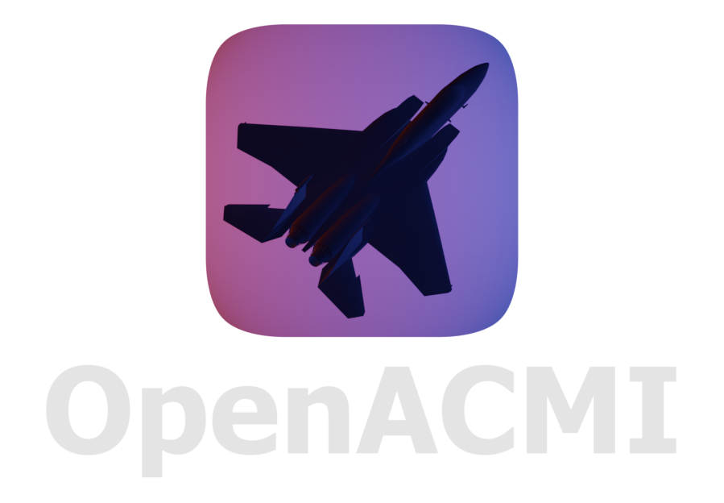

# OpenACMI


**Free, open-source ACMI flight recording viewer and real-time telemetry monitor.**

> A community-built alternative to Tacview - replay your flights, analyse engagements, and monitor live telemetry from any simulator or data source that speaks the ACMI 2.x protocol.

---

## Why OpenACMI?

[Tacview](https://www.tacview.net/) is excellent software - but it's closed-source, expensive at the Advanced tier, and gives you little control over how your data is processed or displayed. OpenACMI aims to change that.

- **Free, forever.** No subscriptions, no feature tiers.
- **Open source.** Understand exactly what happens to your data. Extend it, fork it, contribute back.
- **Cross-platform.** Runs on Windows, Linux, and macOS.
- **Full ACMI 2.x support.** Any simulator that can export to Tacview can export to OpenACMI - DCS World, Falcon BMS, IL-2, X-Plane, FSX, and more.
- **Real-time streaming.** Connect directly to a live telemetry server and watch engagements unfold as they happen.
- **Built on the Godot Game Engine.** Free Open Source game engine in a great state to serve the purpose of this task.
---

## Features

### 3D Globe Visualisation
- Photorealistic Earth sphere with real-world country borders and lat/lon grid
- Accurate object placement and orientation using geodetic coordinate math
- Automatic projection of flat simulated worlds to the 3D globe
- Smart model scaling - objects remain visible at any zoom level

### ACMI 2.x Parser
- Full implementation of the ACMI 2.2 specification
- Supports all object types: aircraft, helicopters, ground vehicles, ships, weapons, projectiles, navaids, static objects
- Parses all documented properties - radar, engagement ranges, G-forces, fuel, control surfaces, pilot biometrics, and more
- Delta-state handling - omitted fields correctly carry forward from previous frames
- Loads plain `.acmi`, ZIP-compressed `.acmi.zip`, and auto-detects format from file contents

### Real-Time Telemetry
- Connects to any Tacview-compatible real-time telemetry server
- Full handshake protocol implementation
- Displays live data as it streams and saves it to file
- Seamlessly transitions between live and recorded playback

### Timeline & Playback
- Scrub through any recording with a timeline slider
- Smooth interpolation between snapshots for fluid playback
- Frame-step forward and backward
- All object visibility correctly driven by spawn/removal times - missiles appear when fired and disappear on impact

### 3D Models
- Automatic model resolution: exact name matching, variant suffix stripping, type-tag fallback
- Coalition-aware object coloring - blue, red, neutral forces are visually distinct at a glance
- Bring your own `.obj` models - drop them in `Data/Meshes/` and they're picked up automatically

### Camera Modes
- **Global orbit** - rotate around the Earth freely
- **Tracking** - follow any object from behind with adjustable offset
- **Cockpit** - ride inside the selected aircraft with full pitch and roll
- **Free flight** - fly through the scene with WASD controls

### Telemetry Panel
- Data grid showing all available telemetry: position, altitude, heading, speed, G-force, AOA, turn rate, vertical speed, Mach, and more
- Derived values where direct telemetry is unavailable - G-force from turn rate and airspeed, TAS from IAS and altitude, etc.
- All information panels support docking / undocking from main window

---

## Getting Started

*More information will become available along with the initial source release.*

<!--
### Prerequisites

- [Godot 4.x](https://godotengine.org/download) (4.6 recommended)

### Run from source

```bash
git clone https://github.com/your-org/openacmi.git
cd openacmi
# Open the project in Godot 4 and press F5
```

### Load a recording

1. Launch OpenACMI
2. Go to **File → Open** and select any `.acmi` or `.acmi.zip` file
3. Use the timeline slider at the bottom to scrub through the recording
4. Press **Space** to pause/resume

### Connect to a live feed

1. Open the **Connection** panel
2. Enter the hostname and port of your telemetry server (default: `localhost:42674`)
3. Click **Connect**

Compatible sources include DCS2ACMI, TacviewSDK, and any server implementing the Tacview real-time telemetry protocol.
-->
---

## Supported Simulators

OpenACMI aims to support any simulator with a Tacview exporter that works out of the box or with :

| Simulator | Export Method |
|---|---|
| DCS World | DCS2ACMI |
| Falcon BMS | Built-in ACMI export |
| IL-2 Sturmovik | Built-in ACMI export |
| X-Plane | Tacview plugin |
| MSFS / FSX | Tacview plugin |
| Any source | Any server speaking the real-time telemetry protocol |

---

<!--## Architecture

OpenACMI is designed to be layered and extensible. The core data pipeline has no engine dependency - the parser and world model are plain GDScript classes that could be ported to any language:

```
┌─────────────────────────────────────────────────┐
│                  Data Sources                   │
│   .acmi file  │  .acmi.zip  │  TCP live feed    │
└───────────────────────┬─────────────────────────┘
                        │
               ┌────────▼────────┐
               │   ACMIParser    │  Parses ACMI 2.x line by line
               └────────┬────────┘
                        │
               ┌────────▼────────┐
               │  WorldManager   │  Typed object registries,
               │                 │  event log, session metadata
               │  cBaseObject    │
               │  cAircraftObject│
               │  cWeaponObject  │
               │  cGroundObject  │
               │  ...            │
               └────────┬────────┘
                        │
          ┌─────────────▼──────────────┐
          │     Display3D              │  Godot 3D scene
          │                            │  Globe, objects, trails,
          │     Dynamic MeshLibrary    │  camera, timeline UI
          └────────────────────────────┘
```-->

### Key files

| File | Purpose |
|---|---|
| `ACMI_Parser.gd` | Full ACMI 2.x parser |
| `WorldManager.gd` | Session state, typed object dictionaries |
| `cBaseObject.gd` | Base class for all tracked objects |
| `cAircraftObject.gd` | Aircraft with full aerodynamic properties |
| `cWeaponObject.gd` `cGroundObject.gd` etc. | Typed subclasses |
| `cEventObject.gd` | Event log entries |
| `Display3D.gd` | Main 3D viewport - globe, objects, camera |
| `MeshLibrary.gd` | Resolves and caches 3D models by name and type |
| `ClientBase.gd` | Real-time telemetry TCP client |
| `FileManager.gd` | Basic file operations (loading/saving, recent files) |
| `Config.gd` | All user preferences with change signals |
| `ObjectTag.gd` | ACMI type tag constants |

---

## General Roadmap

- [ ] Windows, Linux, macOS release builds
- [ ] Exports of object telemetry to .csv
- [ ] Support for flat world non-real terrains for sims like Nuclear Option
- [ ] Charting of object telemetry
- [ ] Performance Improvements
- [ ] Save live data to file
- [ ] Enhanced 2D plan view
- [ ] Display of radar locks
- [ ] Events Log and visualization
- [ ] Weapons employment log and shot analysis
- [ ] Localization
- [ ] Tile map support - stream satellite or terrain imagery from NASA, Maptiler, Stadia, or any XYZ tile provider
- [ ] Use local game terrain heightmaps for enhanced 3D visualization
- [ ] Multi-session overlay (compare two recordings)
- [ ] Plugin API for custom data sources
- [ ] Database XML support (Tacview-compatible object definitions)
- [ ] Screenshot / video export
- [ ] Connection to ADS-B Data
- [ ] Multiplayer debrief mode (shared session over LAN)
- [ ] Multiplayer live controller mode (Custom display for live feeds)
- [ ] Implementation for *.oacm (OpenACMI File Pack) for more functionality
- [ ] File editing (Adding objects, changing parameters, etc.)
- [ ] Attachmet of cockpit display recordings to the recording (Part of *.oacm file)

Have another idea? Post it in an issue!

---

## Contributing

Contributions of all kinds are welcome - code, bug reports, 3D models, simulator-specific testing, documentation.  
*More information will become available along with the initial source release.*

<!--
**Good first issues** are tagged in the issue tracker. The parser and world model are especially approachable - they're self-contained and have no engine dependency beyond GDScript syntax.

### Development setup

1. Install [Godot 4.x](https://godotengine.org/download)
2. Fork and clone the repository
3. Open `project.godot` in the Godot editor
4. Grab a sample ACMI file from the [Tacview website](https://www.tacview.net/) or generate one from your simulator
5. Press F5 to run

### Code style

- GDScript with full static typing throughout
- Class names prefixed with `c` for data classes (`cAircraftObject`, `cWorldManager`)
- Autoloads named `Cfg`, `FileMgr`, `MeshLib`
- Signals for cross-node communication - avoid direct node references where possible

### 3D Models

OpenACMI does not ship 3D models directly. To enable model rendering:

1. Clone the [Tacview community model library](https://github.com/Vyrtuoz/Tacview)
   (GPL v3 licensed — see that repo for terms)
2. Copy the contents of `3D Models/Data/Meshes/` into `Data/Meshes/`
   in your OpenACMI installation

Alternatively, You're welcome to add your own models as `.obj` files into `Data/Meshes/`. The mesh library will try to find the best suit for each model and world entity.

Without models, objects are displayed as placeholder shapes.
The model resolver will automatically pick up any `.obj` files
you place in that folder.

### Adding a simulator

If your simulator isn't listed above and you want to add support, the right place to start is `ACMI_Parser.gd`. File an issue with a sample `.acmi` recording and we can work out what's needed.
-->
---

## License

MIT License - see [LICENSE](LICENSE) for details.

You are free to use, modify, and distribute OpenACMI for any purpose, including commercial applications.

---

## Acknowledgements

- [Tacview](https://www.tacview.net/) by Frantz 'Vyrtuoz' Raia - for the inspiration and ACMI format specification that makes this possible. Also - the 3D model library
- The Falcon BMS, DCS World, and IL-2 communities - for years of ACMI tooling, exporters, and feedback
- [Natural Earth](https://www.naturalearthdata.com/) - country border data
- [NASA Earthdata / GIBS](https://earthdata.nasa.gov/) - satellite imagery

---

*OpenACMI is an independent open-source project and is not affiliated with Tacview or RaiaSoftware.*  
*© Amir "Spearhead" Levy & Contributors*  
